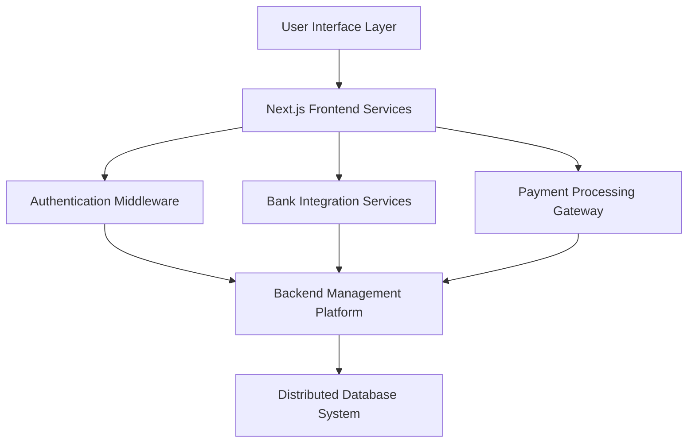

# Next.js Financial SaaS Banking Platform

## Project Overview

A sophisticated financial management platform designed to provide comprehensive banking solutions through modern web technologies. This application delivers a seamless, secure, and intuitive financial management experience, integrating multiple banking services and offering advanced financial insights.

### Project Architecture

The platform leverages cutting-edge web technologies to create a robust, scalable financial management solution:

| Architecture Component | Implementation Details |
|------------------------|------------------------|
| Architectural Pattern | Microservices-oriented |
| Rendering Strategy | Server-Side Rendering (SSR) |
| State Management | Hybrid (React Hooks, Global State Management) |
| Authentication Approach | Multi-layered Security Model |

### Core System Design



## Technical Specifications

### Technology Stack

**Frontend Technologies**
- Next.js 14
- TypeScript
- TailwindCSS
- React Hook Form
- Zod Validation

**Backend Infrastructure**
- Appwrite
- Server-Side Rendering
- API Route Handlers

**Integration Services**
- Plaid API (Bank Account Connectivity)
- Dwolla API (Funds Transfer)

### Performance Metrics

| Performance Indicator | Benchmark |
|----------------------|-----------|
| Initial Load Time | < 1.5 seconds |
| Time to Interactive | < 2.0 seconds |
| Lighthouse Performance Score | 90-95/100 |

## Key Functional Capabilities

### Authentication Framework
- Secure, server-side authentication mechanism
- Multi-factor verification
- Role-based access control
- Comprehensive user validation

### Banking Integration
- Multi-account connection support
- Real-time transaction synchronization
- Comprehensive financial data retrieval
- Secure API token management

### Transaction Management
- Detailed transaction history
- Advanced filtering capabilities
- Pagination support
- Comprehensive transaction tracking

### Financial Visualization
- Interactive financial dashboards
- Spending trend analysis
- Customizable financial reports
- Advanced charting capabilities

## Development Setup

### Prerequisites
- Node.js (Version 18+)
- npm or Yarn package manager
- Valid Plaid Developer Credentials
- Active Dwolla Developer Account

### Local Installation Process

1. Repository Cloning
```bash
git clone https://github.com/[username]/financial-saas-platform.git
cd financial-saas-platform
```

2. Dependency Installation
```bash
npm install
```

3. Environment Configuration
```bash
# Create .env.local file
PLAID_CLIENT_ID=[Your Plaid Client ID]
DWOLLA_API_KEY=[Your Dwolla API Key]
NEXTAUTH_SECRET=[Generated Secret Key]
```

4. Development Server Launch
```bash
npm run dev
```

## Security Considerations

- End-to-end data encryption
- Compliance with financial data protection standards
- Regular comprehensive security audits
- Secure HTTPS communication protocols

## Upcoming Development Roadmap

- [ ] Cryptocurrency wallet integration
- [ ] Machine learning-powered financial recommendations
- [ ] Advanced investment tracking modules
- [ ] Enhanced international transaction support


## Acknowledgments

**Original Tutorial**: Created following the comprehensive course by [JavaScriptMastery](https://www.jsmastery.pro/)

**Course Instructor**: Adrian Hajdin

**Learning Resource**: Build and Deploy a Banking App with Finance Management Dashboard Using Next.js 14

This project is a result of an in-depth tutorial that provides a practical, hands-on approach to building a modern financial SaaS platform using cutting-edge web technologies.

Special thanks to JavaScriptMastery for providing an exceptional learning resource that guided the development of this project. The tutorial offered invaluable insights into full-stack development, API integration, and modern web application architecture.

**Disclaimer**: While based on a tutorial, this implementation represents a personal learning journey and may include custom modifications and improvements beyond the original course content.

## Licensing

Distributed under the MIT License. Refer to `LICENSE` file for complete details.

## Contact and Collaboration

Project Maintainer: Manazir Ali

Repository: https://github.com/mnzralee/financial-saas-platform

**Disclaimer**: This project serves as a technological demonstration of financial technology implementation and should not be considered a production-ready banking solution.
